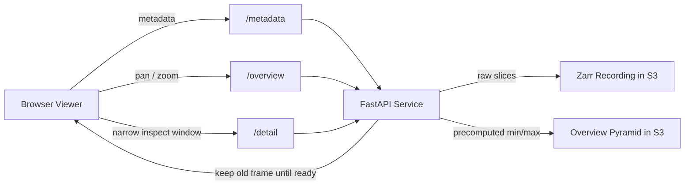
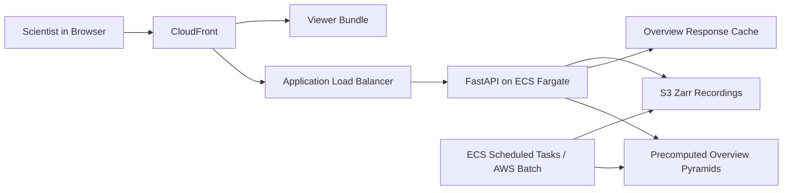

# Browser-Based Trace Viewer

## Engineering Spec

- 48 channels at 2.5 kHz over 1.5 hours in Zarr
- Goal: smooth browser pan and zoom with no blank states
- Thesis: overview navigation and detailed inspection should use different data products
- Hosting baseline: AWS S3 + CloudFront + FastAPI on ECS Fargate

---

# Scope

- Focus on data delivery, not bespoke front-end rendering tricks
- Use small experiments on the mock recording to justify the design
- Go deep on latency, object fan-out, caching, and rollout sequencing
- Keep UI discussion to what is necessary to explain the data path

---

# What The Data Taught Me

| Array | Chunking | Sharding | Objects | Compressed Size | Why It Matters |
| --- | --- | --- | ---: | ---: | --- |
| `current_data` | `[1, 50_000]` | `[1, 1_600_000]` | 432 | 653.42 MiB | This is the hot path for interactive reads |
| `voltage_data` | `[1, 300_000]` | `[1, 9_600_000]` | 96 | 1.33 MiB | Effectively metadata because it compresses away |

- Raw signal volume across both arrays is 2.41 GiB
- The mock file changed my view: `voltage_data` is almost free, so optimizing it early is wasted effort
- Design implication: all latency-sensitive work should optimize `current_data`

---

# Focused Experiments

| Window | Raw Payload, 48 Channels | Est. Objects | Warm Read | Takeaway |
| --- | ---: | ---: | ---: | --- |
| `1s` | 234.38 KiB | 48 | 27.35 ms | Raw is acceptable |
| `10s` | 2.29 MiB | 48 | 27.48 ms | Already too dense for raw pixels |
| `60s` | 13.73 MiB | 48 | 54.75 ms | Summary path should dominate |
| `5min` | 68.66 MiB | 48 | 227.19 ms | Too heavy for interactive refresh |
| `cross_shard` | 9.16 MiB | 96 | 62.81 ms | Shard boundaries amplify fan-out |

- Full-recording raw overview would move 1.21 GiB
- A 1200 px min/max envelope cuts that to 225 KiB, a 5625x reduction
- Initial detail rule: return raw only up to 1.2 seconds per channel at 2.5 samples per pixel

---

# Delivery Model

- `GET /recordings/{id}/metadata`
  returns dimensions, scales, duration, default window, and overview levels
- `GET /recordings/{id}/overview`
  returns cacheable min/max envelopes sized to the viewport width
- `GET /recordings/{id}/detail`
  returns raw `int16` only for narrow windows, otherwise envelope data
- Client rule: keep the previous detail frame visible until replacement data is decoded

---

# Proposed AWS Architecture

- S3 stores canonical Zarr recordings and precomputed overview pyramids
- CloudFront serves the static viewer and caches overview responses aggressively
- FastAPI on ECS Fargate behind an ALB handles metadata and narrow detail reads
- ECS scheduled tasks or AWS Batch build and refresh pyramid levels
- The same pattern ports cleanly to GCP or Azure equivalents

---

# Hard Parts And Tradeoffs

- Shard fan-out
  all-channel reads that cross shard boundaries double object fetches from 48 to 96
- Precompute versus on-demand
  too little preprocessing hurts latency; too much increases storage and build cost
- Admission control
  wide detail requests need concurrency and payload budgets so they do not starve interactive users
- Cache correctness
  cache keys must include recording, channels, window, width, and pyramid level
- UX continuity
  blank redraws during zoom are a product failure even if server latency is acceptable

---

# Build Sequence

1. V1
   metadata endpoint, raw detail, one overview envelope path, binary transport, optimistic client swap
2. V2
   multiresolution pyramid generation, CloudFront caching, adjacent-window prefetch, object-store perf tests
3. V3
   SLO tuning, admission control, auth and multi-tenant concerns, cost dashboards, regression benchmarks

## First Experiments I Would Run Next

- Benchmark direct S3 reads instead of local-disk reads
- Measure browser-side binary decode and draw costs
- Estimate pyramid build time and storage cost per recording
- Migration to gRPC (Greater capacity)

---

# Recommendation

- Treat navigation and inspection as different products
- The mock data materially shaped the design:
  `current_data` is the hot path, `voltage_data` is almost free, and 10-second windows are already envelope territory
- Ship a narrow, evidence-backed first version rather than a broad speculative platform
- Success means no blank frames, common interactions under ~150 ms, and predictable cost per recording
